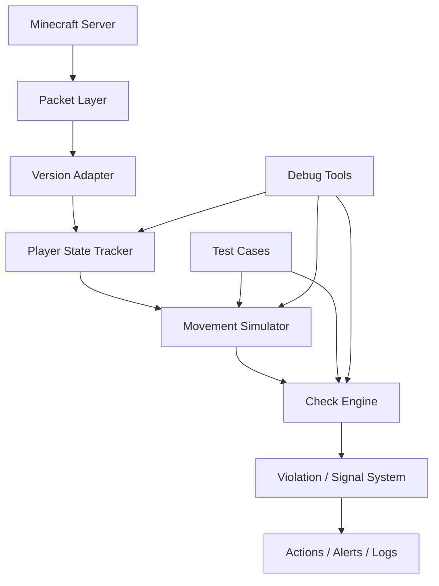
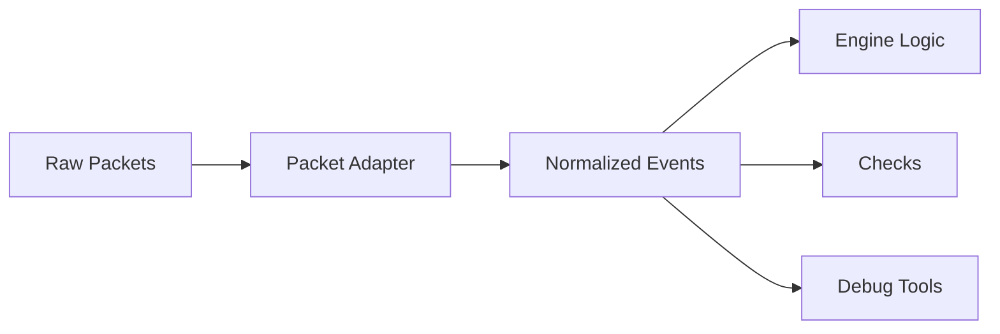
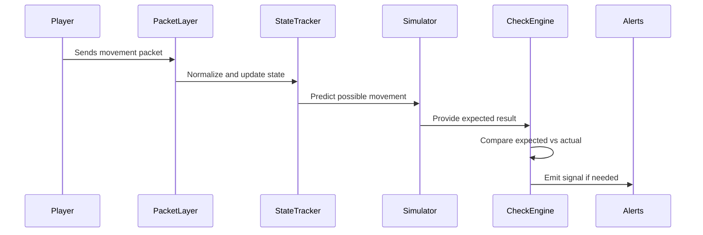
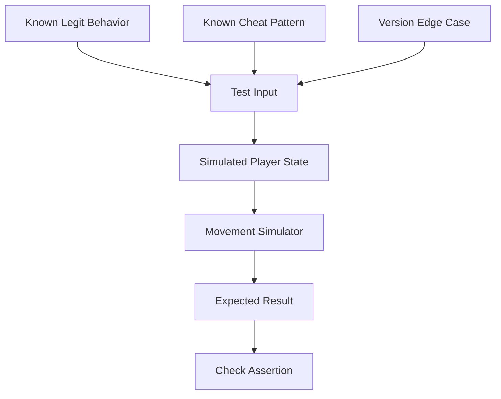
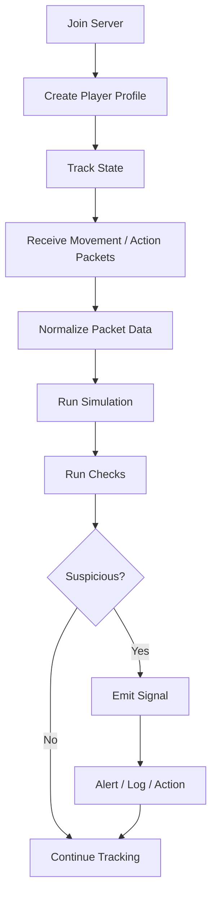
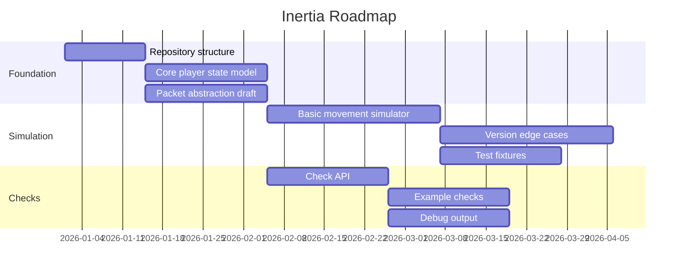

# Inertia

**Open-source Minecraft anti-cheat engine focused on movement simulation, packet abstraction, version support, and shared detection foundations.**

Inertia is not trying to be “just another anti-cheat.”

The goal is to build a clean, reusable foundation for Minecraft anti-cheat development so developers do not have to keep rewriting the same hard parts: movement simulation, version adapters, packet handling, test cases, debug tools, and shared detection infrastructure.

This project is early-stage, but the direction is simple: build the first good brick, then let the community improve it.

---

## Why Inertia exists

Anti-cheat development has a lot of repeated work.

Every serious anti-cheat eventually needs to solve the same problems:

* Minecraft movement rules
* Packet handling
* Version differences
* Prediction and simulation
* False-positive testing
* Debugging tools
* Check pipelines
* Player state tracking
* Protocol edge cases

Most developers solve these alone, inside private projects, again and again.

Inertia exists to make that shared work reusable.

---

## Project status

Inertia is currently in the foundation phase.

That means the first goal is not to ship a finished anti-cheat tomorrow. The first goal is to build the engine pieces that a good anti-cheat can stand on.

Current focus:

* Movement simulation core
* Packet and version abstraction
* Player state model
* Check framework
* Test harness
* Debug-friendly design
* Clean contribution structure

---

## Core idea



Inertia separates the engine into small parts so contributors can work on one system without needing to understand the whole anti-cheat at once.

---

## What Inertia wants to provide

### Movement simulation

A reusable movement simulation layer for Minecraft physics.

This includes:

* Ground movement
* Air movement
* Jumping
* Sprinting
* Sneaking
* Slime, ice, soul sand, honey, ladders, water, lava, and other movement modifiers
* Potion effects
* Knockback and velocity handling
* Version-specific movement differences

The simulator should be testable, readable, and easy to improve.

---

### Packet abstraction

A clean packet layer that hides the ugly version details from the rest of the engine.



Checks should not need to care whether the server is running one Minecraft version or another.

The engine should receive normalized data and work from there.

---

### Check framework

A simple check system for building detections on top of shared engine data.

Example check flow:



Checks should be small, testable, and explainable.

A check should answer three questions:

1. What did the player do?
2. Why is it suspicious?
3. What engine data proves it?

---

### Test-first anti-cheat development

Anti-cheat code without tests becomes guesswork fast.

Inertia should make it easy to add tests for movement, packets, checks, and edge cases.



The long-term goal is to collect real, useful test cases so fixes do not break older behavior.

---

## What Inertia is not

Inertia is not trying to replace every anti-cheat project.

It is also not trying to force every developer into one style.

Inertia is meant to be a foundation:

* Use it to build a full anti-cheat
* Use parts of it inside another project
* Contribute a movement fix
* Add packet support
* Add tests
* Build tools around it

The project is open because the hard parts are better solved together.

---

## Planned modules

The exact module layout may change while the project is young, but the intended structure is:

```text
inertia/
├── inertia-api/              Public API used by checks and integrations
├── inertia-core/             Core engine, state tracking, and pipeline
├── inertia-simulation/       Movement and physics simulation
├── inertia-packets/          Packet abstraction layer
├── inertia-version/          Version adapters and compatibility logic
├── inertia-checks/           Example and built-in checks
├── inertia-testkit/          Test utilities and simulation fixtures
└── inertia-plugin/           Server plugin bootstrap
```

---

## Engine flow



The goal is to keep the pipeline understandable.

A developer should be able to trace a flag from packet input to final signal without digging through magic.

---

## Roadmap



Dates are placeholders. The roadmap shows the intended order, not a strict release promise.

---

## Contribution areas

You do not need to be an anti-cheat expert to help.

Useful contribution areas include:

* Java cleanup
* Movement edge cases
* Packet research
* Version testing
* Unit tests
* Documentation
* Debug tools
* Example checks
* Performance profiling
* False-positive reports

Good contributions are small, clear, and testable.

---

## Development principles

Inertia should stay practical.

The project follows these rules:

* Keep code readable before making it clever
* Prefer small systems over huge hidden logic
* Add tests for behavior that can break
* Explain checks clearly
* Do not punish players from uncertain data alone
* Keep version-specific logic isolated
* Make debugging possible from day one
* Avoid locking the engine to one server version or one packet library too early

---

## Example check concept

This is only an example of the style Inertia should aim for:

```java
public final class ExampleSpeedCheck extends MovementCheck {

    @Override
    public void handleMovement(MovementContext context) {
        double expected = context.simulation().maxPossibleHorizontalSpeed();
        double actual = context.movement().horizontalDistance();

        if (actual > expected + context.tolerances().speedBuffer()) {
            flag(context, "horizontal speed exceeded expected movement");
        }
    }
}
```

Checks should be boring in a good way.

The complex work belongs in the engine: simulation, state, version handling, and test coverage.

---

## Repository goals

A good first version of Inertia should be able to:

* Start on a supported Minecraft server
* Track player movement state
* Normalize packet or movement input
* Simulate basic movement
* Run simple checks
* Produce useful debug output
* Run tests without needing a live server for every case

After that, the project can grow into deeper checks, better version support, more physics coverage, and real-world testing.

---

## License

Inertia is licensed under the **Apache License 2.0**.

This keeps the project open while also giving contributors and downstream projects clearer legal protection for long-term use.

See [`LICENSE`](LICENSE) for details.

---

## Final note

Inertia starts with a simple belief:

Minecraft anti-cheat developers should not have to rebuild the same foundation forever.

If the base is good enough, people can improve it instead of rewriting it.

That is the point of this project.
